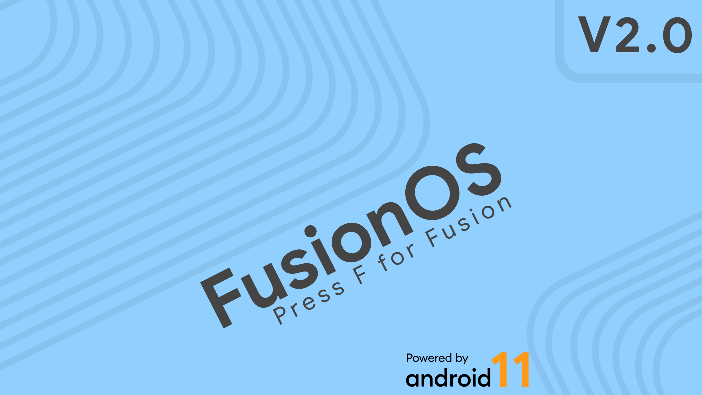

### Requirements
- Around 200G disk space.
- A computer/server with at least 16GB RAM running Linux.
- Some brain cells.

### Instructions
1. Make sure you have a build environment setup.

### Sync ###
```bash
        repo init -u https://github.com/fusionos-next/android_manifest -b twelve
        repo sync --current-branch --force-sync --no-clone-bundle --no-tags --optimized-fetch --prune -j$(nproc --all)

```

### Build ###
```bash
        source build/envsetup.sh
        lunch fuse_$device-userdebug
        m bacon -j$(nproc --all)
```

Credits
-------
 * [**AOSP**](https://android.googlesource.com)
 * [**LineageOS**](https://github.com/LineageOS)
 * [**HentaiOS**](https://github.com/hentaios)
 * [**Paranoid Android**](https://github.com/AOSPA)
 * [**LineageOS**](https://github.com/LineageOS)
 * [**StormbreakerOSS**](https://github.com/StormbreakerOSS)
 * [**ProtonAOSP**](https://github.com/ProtonAOSP)
 * [**StyxOS**](https://github.com/styx-os)
 * [**Pixel Experience**](https://github.com/PixelExperience)
 * And the list never ends.
